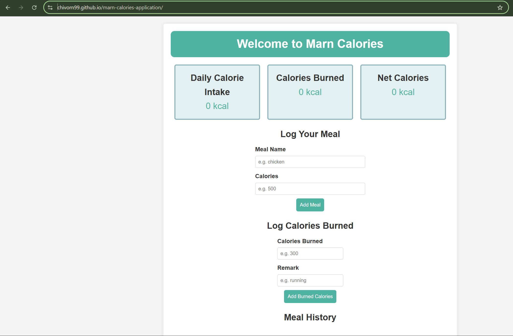
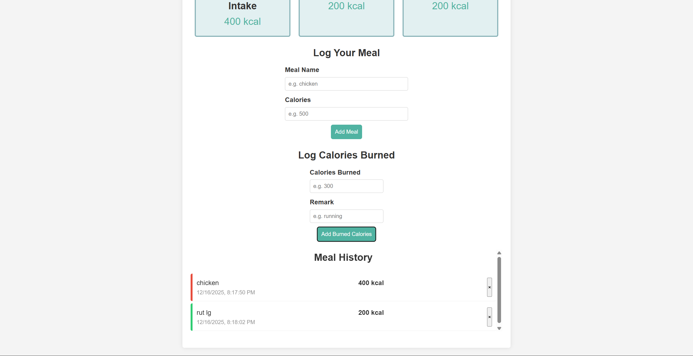

# Marn Calories Tracker

**Created by: Nhoung Norakchivorn**

## 🔗 Live Demo
[View Live Site](https://chivorn99.github.io/marn-calories-application/)

## 📸 Screenshots

### Desktop View



## 📋 Project Overview

A simple web application that helps users track their daily calorie intake and calories burned through meals and activities. Built with JavaScript using functional programming principles including closures, higher-order functions, and arrow functions.

## ✨ Features

### Core Functionality
1. **Meal Logging** - Record food items with calorie counts
2. **Activity Tracking** - Log calories burned with activity descriptions
3. **Real-time Dashboard** - View total intake, burned calories, and net balance
4. **Persistent History** - All entries saved to localStorage
5. **Delete Entries** - Remove individual meal or activity records
6. **Timestamp Display** - Each entry shows when it was logged

### Dashboard Cards
- **Daily Calorie Intake** - Total calories consumed
- **Calories Burned** - Total calories burned through activities
- **Net Calories** - Difference between intake and burned

### User Interface
- Clean, card-based design with color-coded entries
- Meal entries marked with red border
- Activity entries marked with green border
- Scrollable history section
- Mobile-responsive layout

## 🛠️ Technologies Used

- **HTML5** - Semantic markup
- **CSS3** - Modern styling with flexbox
- **JavaScript** - ES6+ features including:
  - Arrow functions
  - Higher-order functions (`.filter()`, `.reduce()`, `.forEach()`)
  - Closures for state management
  - Spread operator
  - Template literals
  - LocalStorage API

## 💻 How to Run Locally

1. Clone this repository:
   ```bash
   git clone https://github.com/Chivorn99/marn-calories-application.git
   ```

2. Navigate to project folder:
   ```bash
   cd marn-calories
   ```

3. Open `index.html` in your browser, or use Live Server in VS Code

## 📁 Project Structure
```
Health App/
├── index.html          # Main HTML structure
├── style.css           # Styling and layout
├── script.js           # Application logic
├── README.md           # Project documentation
└── screenshots/        # App screenshots
    ├── welcome.png
    └── function.png
```

## 🎯 Learning Objectives

This project demonstrates:
- **Arrow Functions** - Concise function syntax throughout
- **First-Class Functions** - Functions as event handlers
- **Higher-Order Functions** - Using `.filter()`, `.reduce()`, `.forEach()`
- **Closures** - `createHealthTracker()` encapsulates state
- **Spread Operator** - Immutable array updates
- **DOM Manipulation** - Dynamic content rendering
- **Local Storage** - Data persistence

## 🎨 Design Credits

- **Color Scheme**: Teal (#50b3a2) and light blue (#e2f0f1)
- **Fonts**: Arial (system font)
- **Icons**: Unicode symbols (×)

## 📝 Notes

- All data is stored locally in the browser
- No backend or database required
- Entries persist across page refreshes
- Validation ensures positive calorie values
- Clean, minimal design for ease of use

## 🚀 Future Enhancements

- Add category filters (breakfast, lunch, dinner, etc.)
- Implement data visualization with charts
- Export/import data functionality
- Daily calorie goals and progress tracking
- Search and filter history

---

**Built as part of functional programming practice with JavaScript**
